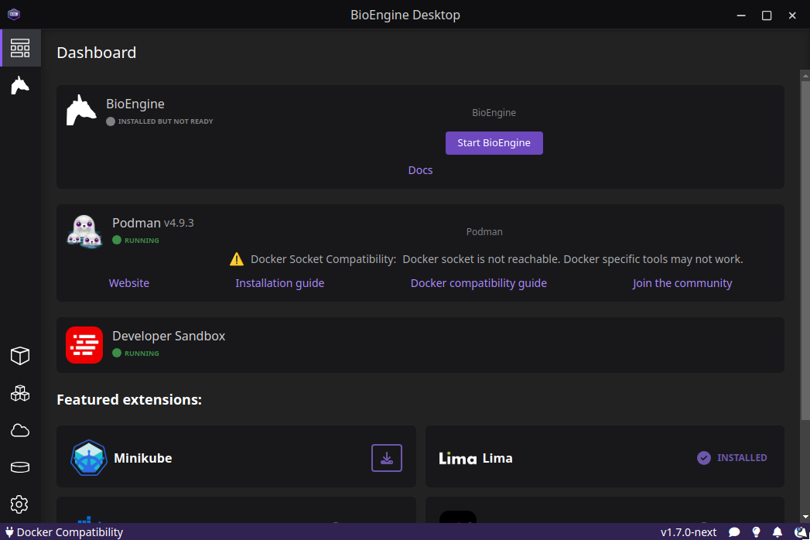

# BioEngine Desktop - A graphical tool for installing and running the BioEngine

## Documentation

- [**Overview**](#overview)
- [**Contributing**](#contributing)
- [**License**](#license)

## Overview

BioEngine Desktop is a graphical interface that enables users to install and start the BioEngine with ease.  

BioEngine Desktop is developed on top of Podman Desktop to provide a robust interface to managing and running a podman pod on your machine. 

## Contributing

### Dev requirements

To build and develop this project, you will need `node` (v20 or above recommended), and `yarn`. 

### Getting started

To get started with development and testing of BioEngine Desktop on your own machine, clone this repository and then run the following commands in the 
project root: 

```terminal
yarn install
yarn run watch
```




## License

Licensed under [Apache 2.0](LICENSE).
